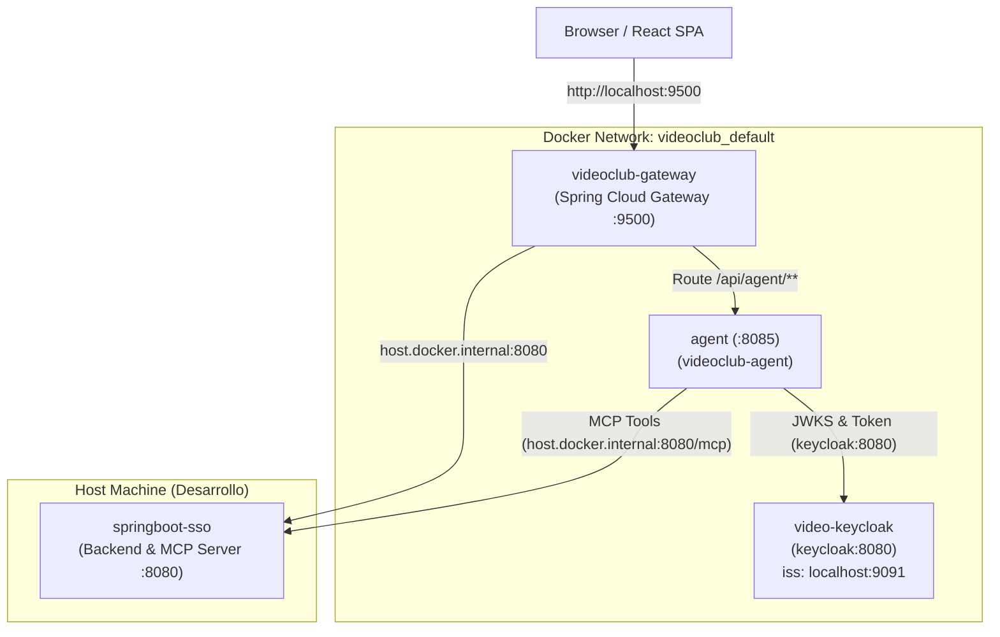
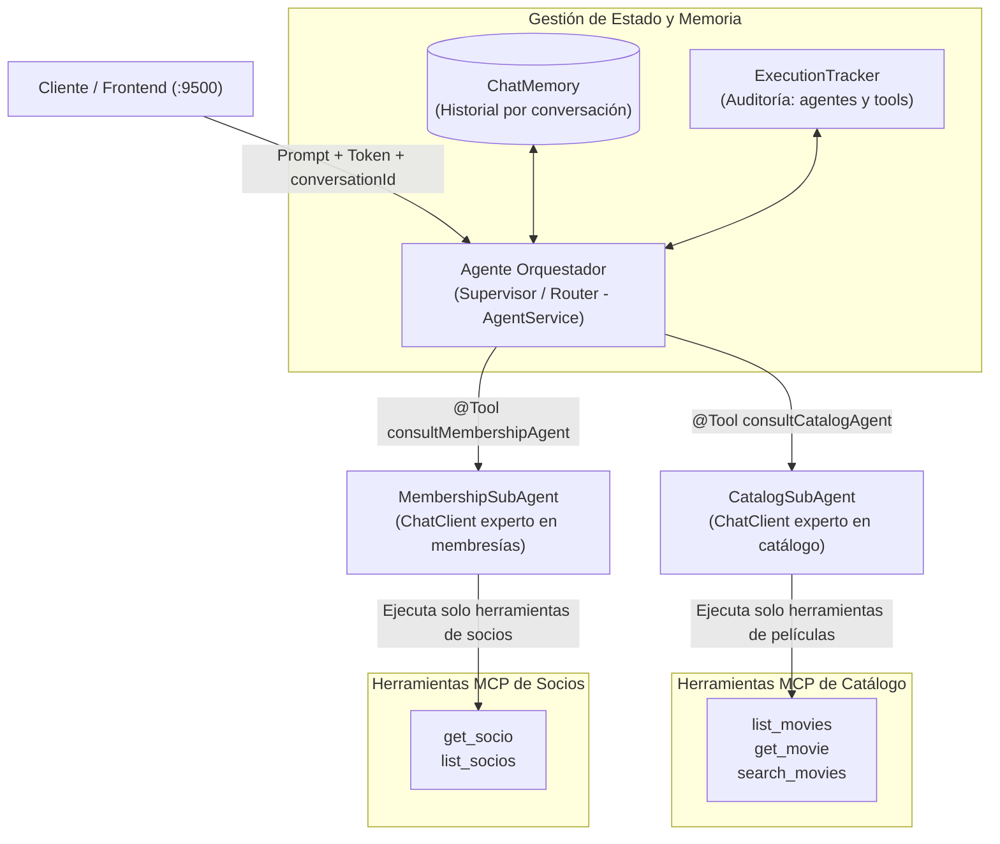

# VideoClub AI Agent Microservice

Spring Boot 4 + Spring AI microservice that acts as an intelligent assistant for the VideoClub ecosystem. It discovers and executes Model Context Protocol (MCP) tools provided by `springboot-sso` under Keycloak SSO authentication.

---

## Features

* **Spring AI & OpenAI**: Natural language processing with tool-calling capabilities.
* **MCP Client**: Dynamic tool discovery and execution via Streamable HTTP (`/mcp`).
* **Keycloak Authentication**: Secure service-to-service and user-authenticated calls.
* **REST Testing Suite**: Ready-to-run `.http` suite in [requests/agent.http](./requests/agent.http).

---

## Documentation

* [SSO Token Propagation (Token Relay) — implemented architecture](./docs/sso-token-propagation.md)
* [Gateway Integration, Token Relay & React Chat Tab (as built)](./docs/gateway-agent-integration.md)
* [HTTP Client Testing Skill](../springboot-sso/.agents/skills/http-client/SKILL.md)

---

## Topología de Red y Arquitectura Docker

El agente se integra al ecosistema de microservicios compartiendo la red Docker **`videoclub_default`** creada por `springboot-sso/docker/services.yaml`.



### Reglas de Comunicación
1. **Gateway ➔ Agent**: El Gateway enruta `/api/agent/**` a `http://agent:8085` usando la resolución DNS interna de Docker.
2. **Agent ➔ Keycloak**: El agente consume los endpoints de JWKS y Token directamente por la red de Docker en `http://keycloak:8080`.
3. **Agent ➔ Backend (MCP)**: El agente invoca las herramientas MCP en `http://host.docker.internal:8080/mcp` saliendo hacia el host donde corre `./mvnw spring-boot:run`.

---

## ¿Por qué es necesario `extra_hosts` en Linux?

En `docker-compose.yml` y `docker-compose.prod.yml` se incluye:
```yaml
extra_hosts:
    - "host.docker.internal:host-gateway"
```

### Razón Técnica
* **En Docker Desktop (macOS / Windows)**: `host.docker.internal` se resuelve de forma automática hacia el host.
* **En Docker nativo sobre Linux**: Este hostname **no existe** por defecto. La directiva `extra_hosts` inyecta en el `/etc/hosts` del contenedor la IP del gateway del bridge Docker (usualmente `172.17.0.1`), permitiendo que el contenedor alcance servicios que corren directamente en el host del desarrollador.

### ¿Cuándo dejará de ser necesario?
Actualmente, `springboot-sso` corre en el host con `./mvnw spring-boot:run`. El día que `springboot-sso` se ejecute dentro de un contenedor en la red `videoclub_default` (por ejemplo con servicio `backend`), la URL pasará a ser `http://backend:8080/mcp` y la directiva `extra_hosts` podrá removerse por completo.

---

## Token Issuer (Keycloak en Docker)

Para que Spring Security en todos los servicios valide los JWTs de manera uniforme provengan del navegador, del gateway o de llamadas internas de red, Keycloak en `springboot-sso/docker/keycloak.yaml` fija su hostname canónico:

```yaml
KC_HOSTNAME: "http://localhost:${KEYCLOAK_PORT:-9091}"
KC_HOSTNAME_BACKCHANNEL_DYNAMIC: "false"
```

* **Validación (`KEYCLOAK_ISSUER_URI`)**: `http://localhost:9091/realms/videoclub` (coincide exactamente con el claim `"iss"` del JWT).
* **Llamadas HTTP salientes (`KEYCLOAK_JWK_SET_URI`, `KEYCLOAK_TOKEN_URL`)**: `http://keycloak:8080/...` (tráfico interno eficiente en Docker).

---

## Entornos Docker Compose (Clase 6)

Siguiendo el principio de **única fuente de la verdad** (*Single Source of Truth*), los archivos Compose no definen valores por defecto (`:-fallback`); toda la parametrización se gestiona de forma explícita en los archivos `.env` y `.env.prod`.

### 1. Desarrollo (`docker-compose.yml`)
* **Nombre de stack**: `name: videoclub` (se adhiere a `videoclub_default`).
* **Hot-reload**: Monta el código fuente local (`.:/app`) y cachea dependencias Maven (`~/.m2:/root/.m2`).
* **Etapa**: `target: dev` sobre `maven:3.9-eclipse-temurin-25`.
* **Comando**: `mvn spring-boot:run`.

```bash
# Preparar variables de entorno
cp .env.template .env
# Configurar OPENAI_API_KEY en .env

# Levantar el entorno de desarrollo
docker compose up -d

# Ver logs
docker compose logs -f agent
```

### 2. Producción (`docker-compose.prod.yml`)
* **Nombre de stack**: `name: videoclub-prod` (namespace aislado).
* **Multi-stage build**: Etapa `target: runtime` con `eclipse-temurin:25-jre-alpine` (~536 MB vs 1.07 GB en dev).
* **Seguridad**: Usuario no-root `app` (`uid 100`).
* **Resiliencia**: `HEALTHCHECK` activo sobre `/api/agent/health` y `restart: always`.
* **Versionado**: Auto-taggeado como `videoclub-agent:${APP_VERSION}`.

```bash
# Preparar variables de producción
cp .env.prod.template .env.prod

# Construir y levantar en producción
docker compose --env-file .env.prod -f docker-compose.prod.yml up -d --build
```

### 3. Producción Nativa (`target: native-runtime`)

Variante **opcional** del mismo `Dockerfile`: compila el servicio a un ejecutable nativo con GraalVM en vez de correrlo sobre la JVM. No reemplaza a la etapa `runtime`; conviven.

* **Etapa `native-build`**: `ghcr.io/graalvm/native-image-community:25`, compila con `native-maven-plugin`.
* **Etapa `native-runtime`**: `debian:bookworm-slim`, usuario no-root, `HEALTHCHECK` con `start-period` corto.
* **Selección**: las variables `BUILD_TARGET` e `IMAGE_SUFFIX` tienen valores por defecto (`runtime` y vacío), de modo que el comando JVM de arriba no cambia.

```bash
# Opción A: ad-hoc, con las variables en la misma línea
BUILD_TARGET=native-runtime IMAGE_SUFFIX=-native \
  docker compose --env-file .env.prod -f docker-compose.prod.yml up -d --build

# Opción B: fijo, con su propio archivo de entorno
cp .env.prod.native.template .env.prod.native
docker compose --env-file .env.prod.native -f docker-compose.prod.yml up -d --build
```

> **No se usa `./mvnw spring-boot:build-image -Pnative`.** Ese goal arma la imagen con Paketo buildpacks y necesita hablar con el daemon de Docker, algo imposible dentro de un build multi-stage. La etapa `native-build` compila a mano en dos pasos: `package` (que dispara el `process-aot` de Spring) y luego `native:compile-no-fork`.

#### Ventajas y desventajas (medidas en este proyecto)

| | JVM (`runtime`) | Nativo (`native-runtime`) |
| :--- | :--- | :--- |
| **Arranque** | 2,8 – 3,5 s | **0,10 – 0,12 s** |
| **Tamaño de imagen** | 536 MB | 452 MB |
| **Tiempo de compilación** | segundos | **~2 min 30 s** |
| **RAM pico al compilar** | normal | **~8,9 GB** |
| **Errores de reflexión** | no existen | **aparecen en runtime** |

**A favor**
* **Arranque ~26× más rápido.** Es la diferencia entre un servicio que escala a cero y vuelve al instante, y uno que hace esperar al primer request.
* **Sin calentamiento ni JIT**: el rendimiento es el mismo desde el primer request.
* **Menor consumo de memoria en ejecución** al no haber heap de JVM ni metaespacio.

**En contra**
* **El tamaño casi no baja** (452 MB vs 536 MB). El binario solo ya pesa 244 MB: la imagen nativa no es automáticamente liviana. La base `debian:bookworm-slim` tampoco ayuda, pero es obligatoria (ver abajo).
* **Compilar cuesta caro**: dos minutos y medio y ~9 GB de RAM. Si el daemon de Docker no tiene memoria suficiente, el build muere sin mensaje claro.
* **Mundo cerrado**: todo lo que se resuelva por reflexión debe declararse en tiempo de compilación. Lo que la JVM descubre sobre la marcha, acá falla en runtime (ver [ADR-023](./docs/adr.md#adr-023-imagen-nativa-graalvm-como-etapa-opcional-y-no-como-reemplazo)).
* **Ciclo de feedback lento** para depurar: cada intento cuesta una compilación completa.

#### Por qué el runtime nativo es Debian y no Alpine

La imagen de GraalVM está basada en Oracle Linux, o sea **glibc**. Alpine usa **musl**. Un binario compilado contra glibc **no arranca** sobre Alpine. La alternativa sería compilar con `--static --libc=musl`, lo que exige un toolchain musl en la etapa de build. Por eso la etapa `runtime` (JVM) sí usa Alpine y la `native-runtime` no.

#### Hints de reflexión

`config/NativeRuntimeHints.java` declara lo que el análisis estático no puede ver: los métodos `@Tool` del orquestador y los records que Jackson liga por fuera de una firma de controller. Es un **no-op en la JVM** — la clase solo se activa durante el procesamiento AOT.

Para verificar un hint **sin pagar la compilación completa**:

```bash
./mvnw -Pnative clean package -DskipTests
rg "OrchestratorTools" target/classes/META-INF/native-image/ar.unrn/videoclub-agent/reachability-metadata.json
```

> Spring Boot 4 genera un `reachability-metadata.json` unificado; ya **no** existen los antiguos `reflect-config.json`.

---

## Verificación End-to-End

### 1. Healthcheck a través del Gateway
```bash
curl -i http://localhost:9500/api/agent/health
# HTTP/1.1 200 OK -> {"status":"UP","agent":"videoclub-agent"}
```

### 2. Consulta al Agente con Token de Usuario
```bash
# Obtener token de Keycloak
USER_TOKEN=$(curl -s -X POST "http://localhost:9091/realms/videoclub/protocol/openid-connect/token" \
  -d "client_id=videoclub-frontend" \
  -d "username=usuariocliente" \
  -d "password=usuariocliente" \
  -d "grant_type=password" | jq -r '.access_token')

# Enviar consulta al agente pasando por el Gateway
curl -s -X POST "http://localhost:9500/api/agent/chat" \
  -H "Authorization: Bearer $USER_TOKEN" \
  -H "Content-Type: application/json" \
  -d '{"prompt": "¿Qué películas hay en el catálogo?"}' | jq .
```

---

## Arquitectura Multi-Agente Jerárquica (Spring AI)

El servicio implementa el patrón **Supervisor / Hierarchical Multi-Agent System**:



### Componentes:
1. **`AgentService` (Orquestador / Supervisor)**:
   - Atiende al usuario, clasifica intenciones y sintetiza respuestas integradas.
   - Responde saludos y preguntas generales directamente sin invocar herramientas ni gastar tokens innecesarios.
   - Cuenta con herramientas de delegación `@Tool` (`consultCatalogAgent`, `consultMembershipAgent`).
2. **`CatalogSubAgent` (Especialista en Catálogo)**:
   - ChatClient aislado con system prompt experto en películas.
   - Conectado exclusivamente a herramientas MCP de películas (`list_movies`, `get_movie`, `search_movies`).
3. **`MembershipSubAgent` (Especialista en Membresías y Socios)**:
   - ChatClient aislado con system prompt experto en socios y permisos.
   - Conectado exclusivamente a herramientas MCP de socios (`get_socio`, `list_socios`).
4. **`ExecutionTracker`**:
   - Registra en tiempo de ejecución los sub-agentes convocados (`agentsInvoked`), las herramientas ejecutadas (`toolsExecuted`) y los artefactos Generative UI producidos (`artifacts`).
   - **Los artefactos se capturan en `OrchestratorTools`**, en el momento en que el sub-agente retorna, y el orquestador recibe la prosa ya sin el bloque estructurado. Se hace así porque el orquestador es un modelo de lenguaje que reescribe prosa: se lo observó convirtiendo el bloque del sub-agente en viñetas markdown, destruyendo las tarjetas en silencio. No puede romper lo que nunca recibe (ver [ADR-024](./docs/adr.md#adr-024-el-artefacto-generative-ui-se-captura-antes-del-orquestador)).
5. **`AbstractDomainSubAgent` (Base y Protección Fail-Fast)**:
   - Clase base abstracta que encapsula el filtrado de herramientas, el registro en el tracker y la ejecución del ChatClient.
   - **Fail-Fast contra Alucinaciones**: Si un sub-agente especializado detecta 0 herramientas MCP disponibles para su dominio, interrumpe de inmediato con `IllegalStateException` y log `ERROR`. Esto previene la degradación silenciosa donde el LLM respondería inventando datos falsos sin herramientas reales.
6. **Resolución de Anáforas en la Delegación (Context-Preserving Rewording)**:
   - Los sub-agentes se mantienen *stateless* y enfocados en su dominio. Para preservar el contexto conversacional sin duplicar la memoria, el orquestador (`AgentService`) reformula la consulta en el parámetro `query` de forma 100% auto-contenida, resolviendo referencias previas y pronombres antes de invocar la tool.
7. **Resiliencia y Mapeo de Errores (`AgentController`)**:
   - Excepciones de falta de token o JWT inválido se mapean a `401 Unauthorized`.
   - Ausencia o fallo de herramientas de dominio se mapea a `503 Service Unavailable`.
   - Sanitización de errores 500 para evitar fugas de trazas y nombres de clases internas.
