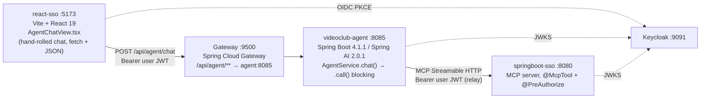

# AG-UI Streaming Integration — Implementation Plan

**Status:** proposed. Nothing implemented in any of the three services.
**Scope:** `videoclub-agent` (:8085), `react-sso` (:5173), `springboot-sso` (:8080 + gateway :9500).

Companion documents: [`gateway-agent-integration.md`](./gateway-agent-integration.md) (as-built call
flow) and [`sso-token-propagation.md`](./sso-token-propagation.md) (security model). This plan builds
on both and does not restate them.

---

## 0. The version confusion, cleared up first

The brief that started this work prescribes:

```xml
<groupId>com.ag-ui.community</groupId>
<artifactId>spring-ai</artifactId>
<version>1.0.1</version>
<!-- and com.ag-ui.community:spring-server:1.0.1 -->
```

Two separate problems with that, and they are worth separating because they have different answers.

### 0.1 Those exact coordinates do not exist

Verified against Maven Central on 2026-09-14:

| Check | Result |
|---|---|
| `repo1.maven.org/maven2/com/ag-ui/community/` | `200` — contains only `java-ag-ui`, `java-client`, `java-core`, `java-server`, `kotlin-*` |
| `.../com/ag-ui/community/spring-ai/maven-metadata.xml` | `404 Not Found` |
| `.../com/ag-ui/community/spring-server/maven-metadata.xml` | `404 Not Found` |

The published artifact matching that `1.0.1` lives in a different namespace:
`io.github.pascalwilbrink.ag-ui.community:spring-ai:1.0.1`.

### 0.2 There are two different `1.0.1` in play — this is NOT a downgrade of our stack

This is the part that reads wrong at first glance, so state it explicitly:

| What | Version | Meaning |
|---|---|---|
| The AG-UI Spring integration module | **1.0.1** | the module's *own* release number |
| `org.springframework.ai:spring-ai-model` / `spring-ai-client-chat` that it declares | **1.0.1** | Spring AI itself, an older line than ours |

Same number, unrelated things. **Nothing in this plan downgrades our platform.** We stay on
**Spring Boot 4.1.1 / Spring Framework 7.0.9 / Spring AI 2.0.1 / Java 25** throughout.

What the published `1.0.1` module *is* compiled against, however, matters. Its class files
reference:

```
org/springframework/ai/chat/client/advisor/PromptChatMemoryAdvisor
org/springframework/ai/chat/client/advisor/PromptChatMemoryAdvisor$Builder
```

and that class was **removed in Spring AI 2.x**:

```
spring-ai-client-chat-1.0.1   PromptChatMemoryAdvisor: present
spring-ai-client-chat-2.0.1   PromptChatMemoryAdvisor: ABSENT
spring-ai-model-2.0.1         PromptChatMemoryAdvisor: ABSENT
```

So dropping the **published jar** into our `pom.xml` fails at runtime with
`NoClassDefFoundError`. And it would not even fail cleanly: our POM imports `spring-ai-bom:2.0.1`
in `dependencyManagement`, which in Maven always wins over transitive versions — so Maven resolves
`spring-ai-client-chat:2.0.1` while the module stays compiled against the 1.0.1 API. To genuinely
downgrade you would have to change the BOM, and that drops the MCP server, since
`spring-ai-starter-mcp-server-webmvc` requires Spring AI 2.x.

**Conclusion: the published artifact is unusable as-is.** That is a statement about the jar, not
about the project — see the next section, which changes the recommendation.

---

## 1. Two viable routes — one of them is measured, not estimated

### Route A — write the adapter against the protocol library

`com.ag-ui.community:java-core:0.1.1` + `java-server:0.1.1` — the official AG-UI library for the
JVM, released from `github.com/ag-ui-protocol/ag-ui` on 2026-09-09, Apache-2.0, `release=17`, and
**zero Spring dependencies** (`java-core` declares no external dependencies at all).

Its whole server-side surface is four types:

```java
public interface Agent    { Flow.Publisher<Event> run(RunAgentInput input); }
public interface EventSink{ void write(String chunk); void close(); }
public final class AgentRunHandler {
    AgentRunHandler(Agent agent, Serializer serializer);
    RunAgentInput parse(String json);
    CompletableFuture<Void> run(RunAgentInput input, EventSink sink);
}
public interface Serializer { /* no implementation ships in java-core */ }
```

We implement `Agent` over `AgentService`, `EventSink` over `SseEmitter`, and `Serializer` over the
Jackson `ObjectMapper` Boot already provides. Nothing here owes anything to a Spring AI version.

### Route B — fork `Work-m8/ag-ui-4j` and bump it

The local clone at `/home/horacio/proyectos/unrn/taller/ag-ui-4j` is the **source repository** the
published artifacts come from. That is a different thing from the published jar, and it changes the
arithmetic — so instead of estimating, the migration was actually performed on a throwaway copy.

**What was changed — three edits, nothing else:**

| # | File | Change |
|---|---|---|
| 1 | `integrations/spring-ai/pom.xml` | `<spring-ai.version>` `1.0.1` → `2.0.1` |
| 2 | `integrations/spring-ai/.../SpringAIAgent.java` | `PromptChatMemoryAdvisor` → `MessageChatMemoryAdvisor` (the import at line 13 and the single call site at line 302) |
| 3 | `servers/spring/pom.xml` | `spring-context` / `spring-webmvc` `6.2.9` → `7.0.9`; `spring-boot-autoconfigure` / `spring-boot-configuration-processor` `3.4.3` → `4.1.1` |

**What the compiler said before edit 2** — exactly two errors, both the same symbol, nothing else in
the module:

```
SpringAIAgent.java:[13,50] cannot find symbol
  symbol:   class PromptChatMemoryAdvisor
SpringAIAgent.java:[302,21] cannot find symbol
  symbol:   variable PromptChatMemoryAdvisor
2 errors
```

**Result after the three edits**, on JDK 25 / Spring AI 2.0.1 / Spring Framework 7.0.9 / Boot 4.1.1:

```
AG-UI-4J Core 0.0.1 ....... SUCCESS
json 0.0.1 ................ SUCCESS
AG-UI-4J Server 0.0.1 ..... SUCCESS
AG-UI-4J Spring AI 2.0.1 .. SUCCESS
spring 0.0.1 .............. SUCCESS
BUILD SUCCESS
Tests run: 175, Failures: 0, Errors: 0, Skipped: 0
```

Every other Spring API the two modules touch survives the jump — verified class by class against
`spring-ai-model-2.0.1` / `spring-ai-client-chat-2.0.1` and `spring-core/context/web/webmvc-7.0.9` /
`spring-boot-autoconfigure-4.1.1`:

`ChatClient`, `advisor.api.Advisor`, `ChatMemory`, `ChatModel`, `ChatResponse`, `ToolContext`,
`Prompt`, `ToolCallback`, `ToolDefinition`, `@Tool`, `@ToolParam`, `JsonParser`,
`org.springframework.lang.Nullable`, `StringUtils`, `SseEmitter`, `@AutoConfiguration`,
`@ConditionalOnClass`, `@ConditionalOnMissingBean`, `@Bean` — all present.

**So yes: the answer to "can we take that base project and modify it?" is yes, and it is three
edits.** That is materially cheaper than this plan originally assumed.

### What Route B buys, and what it costs

Route B is not just "the same thing, pre-written". `SpringAIAgent.java` is 531 lines that already do
the Spring AI → AG-UI event mapping, and `servers/spring` adds `AgUiService` (150), `AgUiParameters`
(183) and a Boot auto-configuration (87). That is roughly 1,150 lines of already-tested work.

| | Route A (adapter over `java-core:0.1.1`) | Route B (fork `ag-ui-4j`) |
|---|---|---|
| Code we write | the adapter, plus the whole event mapping if we want `TOOL_CALL_*` and `STATE_*` | three edits |
| Code we own forever | small and ours | a fork of someone else's library |
| Protocol line | `0.1.1` (newer, `ag-ui-protocol` org) | `0.0.1` (older line, `com.ag-ui` groupId) |
| Upstream updates | just bump the version | rebase the fork each time |
| Publishing | nothing to publish | must `mvn install` locally or vendor the modules; the `com.ag-ui:0.0.1` coordinates would collide if ever published |
| Teaching value for the taller | the protocol is visible in our own code | the protocol is behind a facade |

### Open question that decides it — check this before committing

`SpringAIAgent` builds its **own** `ChatClient` from a `ChatModel`, with its own memory advisor and
its own `ToolCallback` list. Our `AgentService` is not a plain chat: it is a supervisor that
delegates through `OrchestratorTools` to `CatalogSubAgent` / `MembershipSubAgent`, seeds memory with
the caller's profile, and — per ADR-B below — must carry a per-request identity into every MCP call.

**Unverified:** whether `SpringAIAgent`'s fixed pipeline accommodates that without being rewritten.
If it does, Route B wins outright. If we end up rewriting the inside of those 531 lines anyway,
Route B's advantage evaporates and Route A's smaller surface is better. Reading `SpringAIAgent.java`
against `AgentService.java` is a one-sitting task and it is **step 0 of this plan**.

Two further notes on Route B, neither a blocker:

- `PromptChatMemoryAdvisor` → `MessageChatMemoryAdvisor` is **not a pure rename**. The prompt variant
  injects history into the system prompt; the message variant injects it as a message list. It
  compiles and the tests pass, but it is a behaviour change to validate. (Our `AgentService` already
  uses `MessageChatMemoryAdvisor`, so the fork would become *more* consistent with our code, not
  less.)
- The build surfaces two deprecated-for-removal warnings under 2.0.1:
  `ChatClientRequestSpec.toolCallbacks(List)` (lines 258, 274) and
  `org.springframework.ai.util.json.JsonParser` (`StateTool.java:28`). Debt, not breakage.

---

## 2. Where the three repositories stand today



| Repo | Relevant state |
|---|---|
| `videoclub-agent` | `AgentController.chat()` is blocking, one JSON body. `AgentService.chat()` uses `.call().content()`. Sub-agent delegation via `OrchestratorTools`; MCP tools tracked by `TrackingToolCallback` + `ExecutionTracker`. |
| `react-sso` | `AgentChatView.tsx` — ~450 lines of hand-written chat UI with inline styles. No streaming, no markdown; tool badges appear only after the full response lands. |
| `springboot-sso` | Untouched except `docker/gateway/gateway.yml`. The `agent-service` route already matches `/api/agent/**`. |

The gap this closes: today the user watches "⏳ El Asistente está analizando tu consulta…" for the
whole turn — several seconds, given an orchestrator that delegates to a sub-agent that calls MCP
tools — and then gets everything at once.

---

## 3. Architecture decisions

### ADR-A: bridge `Flux` to `Flow.Publisher`, do not adopt WebFlux

Spring AI 2.0.1 streams Reactor types (verified by `javap` on `spring-ai-client-chat-2.0.1.jar`):

```java
public interface ChatClient$StreamResponseSpec {
    Flux<ChatClientResponse> chatClientResponse();
    Flux<ChatResponse>       chatResponse();
    Flux<String>             content();
}
```

AG-UI wants `java.util.concurrent.Flow.Publisher`. Different interfaces, but Reactor ships the
adapter and it is already on the classpath:

```java
reactor.adapter.JdkFlowAdapter.publisherToFlowPublisher(flux)   // verified present in reactor-core
```

`videoclub-agent` stays on `spring-boot-starter-web` (MVC); SSE is `SseEmitter`. **No WebFlux
migration.** Applies to both routes.

### ADR-B: the SecurityContext will not survive the stream — fix it explicitly, not magically

This is the one that will bite, on either route.

`TokenRelayService.getUserBearerToken()` reads `SecurityContextHolder`, a `ThreadLocal`. Today that
works because `.call()` runs tools synchronously on the servlet thread. Under `.stream()`, the
subscription — and every tool call with it — runs on the HTTP client's event-loop thread. The
`ThreadLocal` is empty there, and the method does not degrade quietly: it throws.

That is not accidental. Its own Javadoc records why:

> An earlier revision had `getBearerToken()` silently fall back to the service account whenever the
> `SecurityContext` held no `JwtAuthenticationToken`. That made the agent's identity depend on a
> condition no caller could see: any code path running off the servlet thread would have executed
> tools as the service account instead of as the user…

The class was already hardened against exactly this, and streaming is exactly this.

| Option | How | Trade-off |
|---|---|---|
| **B1 — explicit propagation (recommended)** | Capture `jwt.getTokenValue()` on the servlet thread in the controller, carry it in a per-run value object, and have the MCP transport customizer read it from there instead of from `SecurityContextHolder`. | Visible in the signatures. Nothing to configure, nothing to forget. Costs one parameter threaded through. |
| **B2 — Reactor context propagation** | `micrometer-context-propagation` + Spring Security context propagation + `.contextCapture()`. | No signature churn, but identity again depends on an invisible condition — the exact failure mode `TokenRelayService` was rewritten to remove. One missed `contextCapture()` and the bug is back, silently. |

**Take B1.** For a taller it is also the better lesson: identity is a parameter, not an ambient
global. `getUserBearerToken()` keeps throwing for the existing non-streaming path; the streaming
path gets a sibling that takes the token explicitly.

### ADR-C: frontend — CopilotKit v2 `selfManagedAgents`, no Node runtime

`react-sso` is a Vite SPA. CopilotKit's quickstarts assume Next.js serving app and runtime on one
origin; their own React-SPA guide says a SPA "has no server and no shared origin, so that path
resolves to nothing," and then starts a **separate Node process**.

We do not need it. `@copilotkit/react-core@1.71.1` exposes a `./v2` subpath export (verified in the
published `exports` map) carrying `selfManagedAgents`:

```tsx
import { CopilotKit } from "@copilotkit/react-core/v2";
import { HttpAgent } from "@ag-ui/client";

<CopilotKit selfManagedAgents={{ "videoclub": videoclubAgent }}>
```

Requests go browser → our endpoint directly; the CopilotKit runtime is skipped. **No fourth service
to deploy**, gateway and Keycloak topology unchanged. CopilotKit's guidance for this mode — "your
agent endpoint must authenticate and authorize every request" — is already satisfied.

`@copilotkit/react-core@1.71.1` depends on `@ag-ui/client@0.0.59` directly, so the two stay aligned
by construction.

Auth uses `HttpAgent`'s `fetch` hook, not its static `headers` map, because `react-oidc-context`
silently renews the access token and a value captured at construction goes stale:

```ts
interface HttpAgentConfig extends AgentConfig {
  url: string;
  headers?: Record<string, string>;
  fetch?: HttpAgentFetchFn;          // (url, requestInit) => Promise<Response>
}
```

`ag-ui-4j` ships `examples/copilot-app` and `examples/copilot-app-with-tools` (both Next.js) — useful
as reference for the event wiring, not as a template, since we are not adding Next.js.

### ADR-D: additive endpoint, not a replacement

Add `POST /api/agent/agui`. Keep `POST /api/agent/chat`. The gateway's `/api/agent/**` predicate
already routes both, so the current `AgentChatView` keeps working while the new view is built beside
it. Cutover is a router change; rollback is a router change.

---

## 4. Proposed changes

### 4.1 `videoclub-agent` — the bulk of the work

**Step 0 — decide Route A vs Route B.** Read `SpringAIAgent.java` (531 lines) against
`AgentService.java` and answer the open question in §1: does its pipeline accommodate our supervisor
+ sub-agents + per-request identity, or would we rewrite its insides? One sitting. Everything below
is written route-agnostically except where marked.

**Phase 0 — wire-compatibility spike.** Do this regardless of route, and do it before building on
top.

The TS client is at `0.0.59`; the Java side is `0.1.1` (Route A) or `0.0.1` (Route B). Different
lines either way, and the TS client ships explicit shims named `BackwardCompatibility_0_0_39`,
`_0_0_45`, `_0_0_47`, `_0_0_57` — the wire format has moved more than once. **Note Route B is on the
older `0.0.1` line, so this check matters more there, not less.**

Stand up `POST /api/agent/agui` returning a hardcoded, non-AI sequence — `RUN_STARTED` →
`TEXT_MESSAGE_START` → three `TEXT_MESSAGE_CONTENT` → `TEXT_MESSAGE_END` → `RUN_FINISHED` — and point
a bare `HttpAgent` at it from a scratch page. If the encodings disagree, we find out in an afternoon
instead of after the agent is rewired.

**Phase 1 — the adapter.**

*Route A:*
```
pom.xml                              + java-core 0.1.1, java-server 0.1.1
config/AgUiConfiguration.java         Serializer bean over the Spring ObjectMapper
agui/SseEmitterEventSink.java         EventSink → SseEmitter
agui/VideoclubAgUiAgent.java          implements Agent; wraps AgentService
rest/AgUiController.java              POST /api/agent/agui → SseEmitter
config/SecurityConfiguration.java     authorize /api/agent/agui
```

*Route B:* vendor or `mvn install` the three bumped modules, depend on `spring-ai` + `spring`, and
supply a `SpringAIAgent` bean plus the controller. The auto-configuration in `servers/spring` already
provides `AgUiService`.

Common to both: `RunAgentInput.threadId()` maps to the `ChatMemory` `conversationId` (today it
arrives as `conversationId` in the JSON body — same concept, and `seedInitialMemoryIfEmpty` carries
over unchanged). `AgentService` grows a `chatStream(...)` returning `Flux<ChatResponse>` — same
system prompt, same `OrchestratorTools`, same `MessageChatMemoryAdvisor`, `.call()` becomes
`.stream().chatResponse()`. The existing `chat()` stays. Set `spring.mvc.async.request-timeout` above
the model's worst case.

**Phase 2 — identity across the stream (ADR-B1).** Thread the captured token from the controller
through `AgentService.chatStream` to the MCP transport customizer in `McpClientConfiguration`. The
`discoveryWindow` bootstrap logic is untouched.

**Phase 3 — the events that make this worth doing.** The existing tracking plumbing already sits in
the right place:

| What happens | AG-UI event | Source |
|---|---|---|
| Model emits text | `TEXT_MESSAGE_CONTENT` | `ChatResponse` chunk |
| Orchestrator delegates to a sub-agent | `STEP_STARTED` / `STEP_FINISHED` | `OrchestratorTools.consultCatalogAgent` / `consultMembershipAgent` |
| An MCP tool runs | `TOOL_CALL_START` / `ARGS` / `END` / `RESULT` | `TrackingToolCallback.call()` — it already intercepts every invocation for `ExecutionTracker`; give it an event sink too |
| Turn metadata | `STATE_SNAPSHOT` / `STATE_DELTA` | `agentsInvoked`, `toolsExecuted`, `toolsAvailable`, `fromMemory` — the fields `ChatResponse` returns today |
| Tool denied by `@PreAuthorize` | `TOOL_CALL_RESULT` carrying the denial | denials arrive as tool errors inside HTTP 200; see `sso-token-propagation.md` |
| Unhandled failure | `RUN_ERROR` | replaces today's 401/503/500 branches, which cannot be sent once SSE has started |

`ExecutionTracker` is per-request and mutable today; under streaming it becomes per-run and must be
safe for the subscribing thread. Audit it when Phase 3 lands.

### 4.2 `react-sso`

```
package.json                                   + @copilotkit/react-core, @copilotkit/react-ui (1.71.1)
                                               (@ag-ui/client arrives transitively at 0.0.59)
src/agui/videoclubAgent.ts                     HttpAgent factory with the auth fetch hook
src/components/routes/AgentChatCopilotView.tsx new view: CopilotKit provider + chat component
src/components/App.tsx                         route it
```

```ts
const agent = new HttpAgent({
  url: `${API_BASE_URL}/api/agent/agui`,
  fetch: async (url, init) => {
    const user = await userManager.getUser();           // fresh token, post-renewal
    return fetch(url, {
      ...init,
      headers: { ...init.headers, Authorization: `Bearer ${user?.access_token}` },
    });
  },
});
```

Keep the existing `AgentChatView` on its current route until the new one is accepted. Role chips and
`usePermissions` port over; the hand-rolled `formatText` bold-parser does not — CopilotKit renders
markdown (`react-markdown` / `streamdown` are already in its dependency tree).

Note for the taller: `@copilotkit/react-ui` brings Tailwind-flavoured styling and `katex`, while
`react-sso` uses inline styles today. Budget a visual-integration step rather than discovering it.

### 4.3 `springboot-sso`

Almost nothing — stated plainly so nobody goes looking for work here.

- `docker/gateway/gateway.yml` — the `agent-service` route already matches `/api/agent/**`, so the
  new endpoint is covered. What must be **verified**, not assumed: that Spring Cloud Gateway passes
  the SSE stream through unbuffered and that `DedupeResponseHeader` does not interfere with
  `text/event-stream`.
- `docs/` — an ADR-013 in `docs/adr.md` for the AG-UI transport, plus a `docs/README.md` entry.
- No change to the MCP server, the tools, or `@PreAuthorize`. The authorization model is untouched;
  only the browser↔agent transport changes.

---

## 5. Verification plan

| # | Check | How |
|---|---|---|
| 1 | Wire compatibility Java ↔ TS `0.0.59` | Phase 0 spike, then a retained test asserting the SSE frame bytes per event type |
| 2 | `mvn test` green in `videoclub-agent` | `CatalogSubAgentTest` / `MembershipSubAgentTest` must not regress |
| 3 | Token relay under streaming | Log in as a user **without** `movie-permission-read`; the denial must surface as `TOOL_CALL_RESULT`, and the MCP log must show the user's `sub`, never `service-account-videoclub-backend` |
| 4 | Identity is never ambient | Grep: no `SecurityContextHolder` read on any streaming path |
| 5 | Streaming is real, not buffered | `curl -N` against `:8085`, then `:9500` — chunks must arrive progressively, not as one burst |
| 6 | Memory across turns | Two-turn conversation with an anaphoric second turn ("¿y cuál tiene más stock?") on one `threadId` |
| 7 | Old path intact | `/api/agent/chat` and the existing `AgentChatView` unaffected |
| 8 | Token renewal mid-conversation | Force a silent renew, send a turn; the `fetch` hook must pick up the new token |
| 9 | *(Route B only)* memory-advisor behaviour change | `PromptChatMemoryAdvisor` → `MessageChatMemoryAdvisor` swaps history from system-prompt injection to message-list injection; confirm answer quality on a multi-turn conversation |

---

## 6. Risks and known debt

1. **Version skew is the real risk.** `@ag-ui/client` is `0.0.x`; the Java side is `0.1.x` (Route A)
   or `0.0.1` (Route B). AG-UI is not a stable API yet. Pin exact versions in `pom.xml` and
   `package.json` — no ranges, no `^` — and keep check #1 as a regression test.
2. **Route B means owning a fork.** Three edits today; rebasing forever after. The `com.ag-ui:0.0.1`
   coordinates also collide with upstream if ever published — keep it local-install or vendored.
3. **Route A means `java-core` ships a `Serializer` interface with no implementation.** Ours becomes
   the contract; AG-UI is camelCase on the wire, and that must be asserted by test, not assumed from
   Jackson defaults.
4. **`ExecutionTracker` thread-safety** under a streaming subscription — flagged in Phase 3, not
   optional.
5. **Error semantics change shape.** Once SSE headers are sent, status codes are gone.
   `AgentController`'s 401/503/500 branches have no equivalent; everything becomes `RUN_ERROR`. The
   frontend must render it, and the 401 case must still drive a re-login.
6. **No fallback if the gateway buffers SSE.** The gateway is a fixed published native image; we
   control only `gateway.yml`. Check #5 is a go/no-go, not a nice-to-have.
7. **CopilotKit v2 `selfManagedAgents` is the documented path but a young one.** Escape hatch: drop
   CopilotKit and drive `HttpAgent` from a custom React view — `@ag-ui/client` alone streams and
   renders. We lose the prebuilt UI, not the protocol.
8. **Deprecation debt (Route B):** `ChatClientRequestSpec.toolCallbacks(List)` and
   `org.springframework.ai.util.json.JsonParser` are deprecated-for-removal in 2.0.1.
9. **Not in scope, deliberately:** human-in-the-loop `Interrupt` / `Resume`, frontend-defined tools
   via `RunAgentInput.tools()`, generative UI, shared agent state beyond the metadata snapshot. All
   natural follow-ups once the transport is proven.

---

## 7. Suggested sequencing

| Step | Repo | Gate |
|---|---|---|
| 0 | — | Read `SpringAIAgent.java` against `AgentService.java`; **pick Route A or B** |
| 1 | agent + throwaway page | Spike proves wire compatibility — **stop here if it fails** |
| 2 | agent | `/api/agent/agui` streams real model text; `/api/agent/chat` untouched |
| 3 | agent | Token relay verified under streaming (checks #3, #4) |
| 4 | agent | Tool and step events emitted (check #5 on :8085) |
| 5 | react-sso | CopilotKit view behind a second route, beside the old one |
| 6 | springboot-sso | Gateway SSE verified (check #5 on :9500), ADR-013, docs |
| 7 | react-sso | Cut the default route over; decide whether the old view stays as reference |

---

## Appendix — reproducing the Route B measurement

Performed on a throwaway copy; `/home/horacio/proyectos/unrn/taller/ag-ui-4j` was **not** modified.

```bash
cp -r ag-ui-4j /tmp/agui4j && cd /tmp/agui4j

# edit 1
sd '<spring-ai.version>1.0.1</spring-ai.version>' \
   '<spring-ai.version>2.0.1</spring-ai.version>' integrations/spring-ai/pom.xml

# edit 2
sd 'PromptChatMemoryAdvisor' 'MessageChatMemoryAdvisor' \
   integrations/spring-ai/src/main/java/com/agui/spring/ai/SpringAIAgent.java

# edit 3
sd '<version>6\.2\.9</version>' '<version>7.0.9</version>' servers/spring/pom.xml
sd '<version>3\.4\.3</version>' '<version>4.1.1</version>' servers/spring/pom.xml

mvn -B -pl integrations/spring-ai,servers/spring -am test
# → BUILD SUCCESS, Tests run: 175, Failures: 0, Errors: 0, Skipped: 0
```
