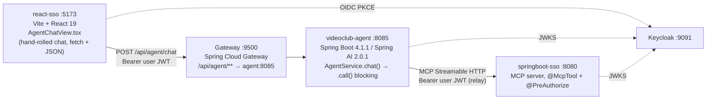

# AG-UI Streaming Integration — Implementation Plan

**Status:** proposed. Nothing implemented yet.
**Scope:** three repositories — `videoclub-agent` (:8085), `react-sso` (:5173), `springboot-sso` (:8080 + gateway :9500).

Companion documents: [`gateway-agent-integration.md`](./gateway-agent-integration.md) (as-built call
flow) and [`sso-token-propagation.md`](./sso-token-propagation.md) (security model). This plan
builds on both and does not restate them.

---

## 0. User Review Required — the premise needs one correction before any code

The brief that started this work prescribes these Maven coordinates:

```xml
<groupId>com.ag-ui.community</groupId>
<artifactId>spring-ai</artifactId>
<version>1.0.1</version>
<!-- and com.ag-ui.community:spring-server:1.0.1 -->
```

**Neither artifact exists.** Verified against Maven Central on 2026-09-14:

| Check | Result |
|---|---|
| `repo1.maven.org/maven2/com/ag-ui/community/` | `200` — contains only `java-ag-ui`, `java-client`, `java-core`, `java-server`, and the `kotlin-*` modules |
| `.../com/ag-ui/community/spring-ai/maven-metadata.xml` | `404 Not Found` |
| `.../com/ag-ui/community/spring-server/maven-metadata.xml` | `404 Not Found` |

The `1.0.1` in the brief is real, but it belongs to a **different groupId**:
`io.github.pascalwilbrink.ag-ui.community:spring-ai:1.0.1`. That is the same author's personal
namespace, published before the coordinates moved to the `ag-ui-protocol` org. The published POM
for it is the decisive fact:

```xml
<!-- io/github/pascalwilbrink/ag-ui/community/spring-ai/1.0.1/spring-ai-1.0.1.pom -->
<dependency><groupId>org.springframework.ai</groupId>
            <artifactId>spring-ai-model</artifactId><version>1.0.1</version></dependency>
<dependency><groupId>org.springframework.ai</groupId>
            <artifactId>spring-ai-client-chat</artifactId><version>1.0.1</version></dependency>
```

```xml
<!-- io/github/pascalwilbrink/ag-ui/community/spring/0.0.1/spring-0.0.1.pom -->
<dependency><groupId>org.springframework</groupId>
            <artifactId>spring-webmvc</artifactId><version>6.2.14</version></dependency>
<dependency><groupId>org.springframework.boot</groupId>
            <artifactId>spring-boot-autoconfigure</artifactId><version>3.5.8</version></dependency>
```

That library is pinned to **Spring AI 1.0.1 / Spring Framework 6.2 / Spring Boot 3.5**. Our three
services run **Spring Boot 4.1.1, Spring Framework 7, Spring AI 2.0.1, Java 25**. Spring AI 1.x →
2.x is a breaking API change, and so is Spring Framework 6 → 7. Adding it means either downgrading
the whole platform — which would also drop the MCP server, since
`spring-ai-starter-mcp-server-webmvc` requires Spring AI 2.x — or fighting dependency convergence
for a wrapper we do not need.

So the article's `SpringAIAgent` / `AgUiService` / `AgUiParameters` classes are **not available to
us**, and every code block in the brief that uses them has to be discarded.

### What we use instead

`com.ag-ui.community:java-core:0.1.1` + `com.ag-ui.community:java-server:0.1.1` — the official
AG-UI protocol library for the JVM, released from `github.com/ag-ui-protocol/ag-ui` on 2026-09-09,
Apache-2.0, `maven.compiler.release=17`, and — the point — **zero Spring dependencies**. `java-core`
declares no external dependencies at all.

Its entire server-side surface is four types:

```java
public interface Agent {
    Flow.Publisher<Event> run(RunAgentInput input);
}

public interface EventSink {
    void write(String chunk) throws IOException;
    void close() throws IOException;
}

public final class AgentRunHandler {
    AgentRunHandler(Agent agent, Serializer serializer);
    RunAgentInput parse(String json);
    CompletableFuture<Void> run(RunAgentInput input, EventSink sink);
}

public interface Serializer {           // no implementation ships in java-core
    String serialize(Object value);
    <T> T deserialize(String json, Class<T> type);
    <T> List<T> deserializeList(String json, Class<T> type);
}
```

We implement `Agent` over our existing `AgentService`, implement `EventSink` over Spring MVC's
`SseEmitter`, and implement `Serializer` over the Jackson `ObjectMapper` Spring Boot already
provides. That is the whole adapter — roughly 120 lines — and it owes nothing to any Spring AI
version.

`EventType` in `java-core:0.1.1` covers the full protocol: `RUN_STARTED`, `RUN_FINISHED`,
`RUN_ERROR`, `STEP_STARTED`, `STEP_FINISHED`, `TEXT_MESSAGE_START/CONTENT/END/CHUNK`,
`TOOL_CALL_START/ARGS/END/CHUNK/RESULT`, `REASONING_*`, `STATE_SNAPSHOT`, `STATE_DELTA`,
`MESSAGES_SNAPSHOT`, `ACTIVITY_SNAPSHOT/DELTA`, `RAW`, `CUSTOM`.

**Decision needed from you:** confirm we drop the `spring-ai`/`spring-server` wrapper and write the
~120-line adapter against `java-core` + `java-server` directly. Everything below assumes yes.

---

## 1. Where the three repositories stand today



| Repo | Relevant state |
|---|---|
| `videoclub-agent` | `AgentController.chat()` is a blocking `POST` returning one JSON body. `AgentService.chat()` uses `chatClientBuilder.build().prompt()…**.call()**.content()`. Sub-agent delegation via `OrchestratorTools`; MCP tools tracked by `TrackingToolCallback` + `ExecutionTracker`. |
| `react-sso` | `AgentChatView.tsx` — ~450 lines of hand-written chat UI with inline styles, `sendAgentPrompt()` over `apiRequest`. No streaming, no markdown renderer, tool badges rendered only after the full response lands. |
| `springboot-sso` | Untouched by this work except `docker/gateway/gateway.yml`. The `agent-service` route to `http://agent:8085` already matches `/api/agent/**`. |

The user-visible gap this closes: today the user stares at "⏳ El Asistente está analizando tu
consulta…" for the whole turn — which, with an orchestrator that delegates to a sub-agent that
calls MCP tools, is several seconds — and then gets everything at once.

---

## 2. Architecture decisions

### ADR-A: bridge `Flux` to `Flow.Publisher` rather than adopt WebFlux

Spring AI 2.0.1 streams Reactor types (verified by `javap` on `spring-ai-client-chat-2.0.1.jar`):

```java
public interface ChatClient$StreamResponseSpec {
    Flux<ChatClientResponse> chatClientResponse();
    Flux<ChatResponse>       chatResponse();
    Flux<String>             content();
}
```

AG-UI's `Agent.run()` returns `java.util.concurrent.Flow.Publisher<Event>`. These are different
interfaces (`org.reactivestreams.Publisher` vs `Flow.Publisher`), but Reactor ships the adapter and
it is already on the classpath:

```java
reactor.adapter.JdkFlowAdapter.publisherToFlowPublisher(flux)   // verified present in reactor-core
```

`videoclub-agent` stays on `spring-boot-starter-web` (MVC). SSE over MVC is `SseEmitter`, which is
exactly what `EventSink` wraps. **No WebFlux migration.** Reactor is a transitive detail of Spring
AI, not a change of programming model.

### ADR-B: the SecurityContext will not survive the stream — fix it explicitly, not magically

This is the one that will bite, and it is worth understanding before writing a line of code.

`TokenRelayService.getUserBearerToken()` reads `SecurityContextHolder`, a `ThreadLocal`. Today that
works because `.call()` executes tools synchronously on the servlet thread. Under `.stream()`, the
subscription — and therefore every tool call — runs on the HTTP client's event-loop thread. The
`ThreadLocal` is empty there, and the method does not degrade quietly: it throws.

That is not an accident. Its own Javadoc records why:

> An earlier revision had `getBearerToken()` silently fall back to the service account whenever the
> `SecurityContext` held no `JwtAuthenticationToken`. That made the agent's identity depend on a
> condition no caller could see: any code path running off the servlet thread would have executed
> tools as the service account instead of as the user…

So the class was already hardened against exactly this scenario, and streaming is the scenario. Two
ways out:

| Option | How | Trade-off |
|---|---|---|
| **B1 — explicit token propagation (recommended)** | Capture `jwt.getTokenValue()` on the servlet thread in the controller, carry it in a per-run value object handed to the AG-UI `Agent`, and have the MCP transport customizer read it from there instead of from `SecurityContextHolder`. | Visible in the signatures. Nothing to configure, nothing to forget. Costs one parameter threaded through `AgentService`. |
| **B2 — Reactor context propagation** | `micrometer-context-propagation` + Spring Security's context-propagation support + `.contextCapture()` on the `Flux`. | No signature churn, but the identity again depends on an invisible condition — the exact failure mode `TokenRelayService` was rewritten to eliminate. One missed `contextCapture()` and we are back to a silent identity bug. |

**Take B1.** For a taller this is also the better lesson: identity is a parameter, not an ambient
global. B2 gets a paragraph in the docs as the alternative and why we passed on it.

`TokenRelayService.getUserBearerToken()` keeps throwing for the non-streaming path. The new path
gets a sibling that takes the token explicitly.

### ADR-C: frontend — CopilotKit v2 `selfManagedAgents`, no Node runtime

`react-sso` is a Vite SPA. The CopilotKit quickstarts assume Next.js serving both the app and a
`/api/copilotkit` runtime on one origin; their own React-SPA guide spells out that a SPA "has no
server and no shared origin, so that path resolves to nothing," and then spins up a **separate Node
process** for the runtime.

We do not need it. `@copilotkit/react-core@1.71.1` exposes a `./v2` subpath export (verified in the
published `exports` map) carrying `selfManagedAgents`:

```tsx
import { CopilotKit } from "@copilotkit/react-core/v2";
import { HttpAgent } from "@ag-ui/client";

<CopilotKit selfManagedAgents={{ "videoclub": videoclubAgent }}>
```

With `selfManagedAgents`, requests go browser → our endpoint directly; the CopilotKit runtime is
skipped entirely. **No fourth service to deploy**, and the existing gateway + Keycloak topology is
unchanged. CopilotKit's own guidance for this mode — "your agent endpoint must authenticate and
authorize every request" — is already satisfied: `/api/agent/**` is an OAuth2 Resource Server behind
the gateway.

`@copilotkit/react-core@1.71.1` bundles `@ag-ui/client@0.0.59` as a direct dependency, so the two
stay version-aligned by construction.

Auth header injection uses `HttpAgent`'s `fetch` hook rather than its static `headers` map, because
`react-oidc-context` silently renews the access token and a value captured at construction time
goes stale:

```ts
interface HttpAgentConfig extends AgentConfig {
  url: string;
  headers?: Record<string, string>;
  fetch?: HttpAgentFetchFn;          // (url, requestInit) => Promise<Response>
}
```

### ADR-D: additive endpoint, not a replacement

Add `POST /api/agent/agui`. Keep `POST /api/agent/chat` working. The gateway's existing
`/api/agent/**` predicate already routes both, and the current `AgentChatView` keeps functioning
while the CopilotKit view is built beside it. Cutover is a router change, and rollback is a router
change.

---

## 3. Proposed changes

### 3.1 `videoclub-agent` — the bulk of the work

**Phase 0 — wire-compatibility spike (do this first, it is cheap and it de-risks everything).**

`@ag-ui/client` is at `0.0.59`; the Java library is at `0.1.1`. Different version lines, and the TS
client ships explicit shims named `BackwardCompatibility_0_0_39`, `_0_0_45`, `_0_0_47`,
`_0_0_57` — evidence the wire format has moved more than once. Before building anything on top,
prove the two ends agree.

Stand up `POST /api/agent/agui` returning a hardcoded, non-AI event sequence —
`RUN_STARTED` → `TEXT_MESSAGE_START` → three `TEXT_MESSAGE_CONTENT` → `TEXT_MESSAGE_END` →
`RUN_FINISHED` — encoded with `SseEventEncoder`. Point a bare `HttpAgent` at it from a scratch page
and confirm the events arrive parsed. If the Java `0.1.1` encoding and the TS `0.0.59` parser
disagree, we find out here, in an afternoon, instead of after the agent is rewired.

**Phase 1 — the adapter.**

```
pom.xml                                           + java-core 0.1.1, java-server 0.1.1
config/AgUiConfiguration.java                      Serializer bean over the Spring ObjectMapper
agui/SseEmitterEventSink.java                      EventSink → SseEmitter
agui/VideoclubAgUiAgent.java                       implements Agent; wraps AgentService
rest/AgUiController.java                           POST /api/agent/agui → SseEmitter
config/SecurityConfiguration.java                  authorize /api/agent/agui
```

- `VideoclubAgUiAgent.run(RunAgentInput)` maps `input.threadId()` → the `ChatMemory`
  `conversationId` (today that arrives as `conversationId` in the JSON body — same concept, and the
  existing `seedInitialMemoryIfEmpty` logic carries over unchanged), takes the last user message
  from `input.messages()`, calls `AgentService` on the streaming path, and converts
  `Flux<ChatResponse>` → `Flow.Publisher<Event>` via `JdkFlowAdapter`.
- `AgentService` grows a `chatStream(...)` returning `Flux<ChatResponse>`, built from the same
  system prompt, the same `OrchestratorTools`, the same `MessageChatMemoryAdvisor`. `.call()`
  becomes `.stream().chatResponse()`. The existing `chat()` stays for `/api/agent/chat`.
- `AgentRunHandler.run(input, sink)` returns a `CompletableFuture<Void>`; complete or error the
  `SseEmitter` from it, and set `spring.mvc.async.request-timeout` above the model's worst case.

**Phase 2 — identity across the stream (ADR-B1).** Thread the captured token from
`AgUiController` through `AgentService.chatStream` to the MCP transport customizer in
`McpClientConfiguration`. The `discoveryWindow` bootstrap logic is untouched.

**Phase 3 — the events that make this worth doing.** This is the payoff, and the existing tracking
plumbing already sits in the right place:

| What happens | AG-UI event | Where it comes from |
|---|---|---|
| Model emits text | `TEXT_MESSAGE_CONTENT` | `ChatResponse` chunk content |
| Orchestrator delegates to a sub-agent | `STEP_STARTED` / `STEP_FINISHED` | `OrchestratorTools.consultCatalogAgent` / `consultMembershipAgent` |
| An MCP tool runs | `TOOL_CALL_START` / `ARGS` / `END` / `RESULT` | `TrackingToolCallback.call()` — it already intercepts every invocation for `ExecutionTracker`; give it an event sink as well |
| Turn metadata | `STATE_SNAPSHOT` / `STATE_DELTA` | `agentsInvoked`, `toolsExecuted`, `toolsAvailable`, `fromMemory` — the same fields `ChatResponse` returns today |
| Tool denied by `@PreAuthorize` | `TOOL_CALL_RESULT` carrying the denial | Denials arrive as tool errors inside HTTP 200; see `sso-token-propagation.md` |
| Unhandled failure | `RUN_ERROR` | Replaces today's 401/503/500 branches, which cannot be sent once the SSE response has started |

`ExecutionTracker` is currently per-request and mutable; under streaming it becomes per-run and must
be safe for the subscribing thread. Audit it when Phase 3 lands.

### 3.2 `react-sso`

```
package.json                                   + @copilotkit/react-core, @copilotkit/react-ui (1.71.1)
                                               (@ag-ui/client comes transitively at 0.0.59)
src/agui/videoclubAgent.ts                     HttpAgent factory with the auth fetch hook
src/components/routes/AgentChatCopilotView.tsx new view, CopilotKit provider + chat component
src/components/App.tsx                         route it
```

```ts
const agent = new HttpAgent({
  url: `${API_BASE_URL}/api/agent/agui`,
  fetch: async (url, init) => {
    const user = await userManager.getUser();           // fresh token, post-renewal
    return fetch(url, {
      ...init,
      headers: { ...init.headers, Authorization: `Bearer ${user?.access_token}` },
    });
  },
});
```

Keep the existing `AgentChatView` mounted at its current route until the new one is accepted. The
role chips and the `usePermissions` integration port over; the hand-rolled `formatText` bold-parser
does not — CopilotKit renders markdown (`react-markdown` / `streamdown` are already in its
dependency tree).

Note for the taller: `@copilotkit/react-ui` pulls Tailwind-flavoured styling and `katex`. `react-sso`
uses inline styles today. Expect a visual-integration step; budget for it rather than discovering it.

### 3.3 `springboot-sso`

Almost nothing — worth stating plainly so nobody goes looking for work here.

- `docker/gateway/gateway.yml` — the `agent-service` route already matches `/api/agent/**`, so
  `/api/agent/agui` is covered. What must be **verified**, not assumed, is that Spring Cloud Gateway
  passes the SSE stream through unbuffered and that `DedupeResponseHeader` does not interfere with
  `text/event-stream`. If it buffers, the fallback is a dedicated route with the response cached
  disabled.
- `docs/` — an ADR-013 in `docs/adr.md` for the AG-UI transport, and a section in `docs/README.md`.
- No change to the MCP server, the tools, or `@PreAuthorize`. The authorization model is untouched;
  only the transport between browser and agent changes.

---

## 4. Verification plan

| # | Check | How |
|---|---|---|
| 1 | Wire compatibility Java `0.1.1` ↔ TS `0.0.59` | Phase 0 spike; then a retained integration test asserting the SSE frame bytes for each event type |
| 2 | `mvn -pl videoclub-agent test` green | Existing `CatalogSubAgentTest` / `MembershipSubAgentTest` must not regress |
| 3 | Token relay under streaming | Log in as a user **without** `movie-permission-read`; the denial must surface as a `TOOL_CALL_RESULT`, and the MCP server log must show the user's `sub`, never `service-account-videoclub-backend` |
| 4 | Identity is never ambient | Grep: no `SecurityContextHolder` read on any streaming path |
| 5 | Streaming is real, not buffered | `curl -N` against `:8085/api/agent/agui`, then the same against `:9500` — both must show chunks arriving progressively, not one burst at the end |
| 6 | Memory across turns | Two-turn conversation with an anaphoric second turn ("¿y cuál tiene más stock?") over the same `threadId` |
| 7 | Old path still works | `/api/agent/chat` and the existing `AgentChatView` unaffected |
| 8 | Token renewal mid-conversation | Force a silent renew, then send a turn; the `fetch` hook must pick up the new token |

---

## 5. Risks and known debt

1. **Version skew is the real risk.** `@ag-ui/client` is `0.0.x` and the Java library is `0.1.x`;
   both are weeks old. AG-UI is not a stable API yet. Pin exact versions in `pom.xml` and
   `package.json` — no ranges, no `^` — and keep check #1 as a regression test.
2. **`java-core` ships a `Serializer` interface with no implementation.** Ours is the contract. Field
   naming (AG-UI is camelCase on the wire) must be asserted by test, not assumed from Jackson
   defaults.
3. **`ExecutionTracker` thread-safety** under a streaming subscription — flagged in Phase 3, must not
   be skipped.
4. **Error semantics change shape.** Once SSE headers are sent, HTTP status codes are no longer
   available. `AgentController`'s 401/503/500 branches have no equivalent; everything becomes
   `RUN_ERROR`. The frontend must render it, and the 401 case specifically must still drive a
   re-login.
5. **No fallback path if the gateway buffers SSE.** The gateway is a fixed published native image; we
   control only `gateway.yml`. Check #5 is therefore a go/no-go, not a nice-to-have.
6. **CopilotKit v2 `selfManagedAgents` is the documented path but a young one.** If it moves under
   us, the escape hatch is dropping CopilotKit and driving `HttpAgent` directly from a custom React
   view — `@ag-ui/client` alone is enough to stream and render; we lose the prebuilt UI, not the
   protocol.
7. **Not in scope, deliberately:** human-in-the-loop `Interrupt` / `Resume` (present in `java-core`),
   frontend-defined tools via `RunAgentInput.tools()`, generative UI, and shared agent state beyond
   the metadata snapshot. All are natural follow-ups once the transport is proven.

---

## 6. Suggested sequencing

| Step | Repo | Gate |
|---|---|---|
| 0 | agent + throwaway page | Spike proves wire compatibility — **stop here if it fails** |
| 1 | agent | `/api/agent/agui` streams real model text; `/api/agent/chat` untouched |
| 2 | agent | Token relay verified under streaming (checks #3, #4) |
| 3 | agent | Tool and step events emitted (check #5 on :8085) |
| 4 | react-sso | CopilotKit view behind a second route, side by side with the old one |
| 5 | springboot-sso | Gateway SSE verified (check #5 on :9500), ADR-013, docs |
| 6 | react-sso | Cut the default route over; decide whether the old view stays as a reference |
