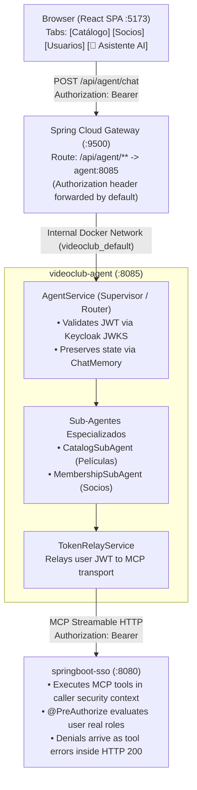

# Gateway Integration, Token Relay & React Chat Tab — As Built

**Status:** delivered across three repositories.

This document records what was built and, more importantly, why each piece looks the way it does.
Several of the decisions below overturned an obvious-looking first approach; those are kept as
warnings rather than deleted.

Companion document: [`sso-token-propagation.md`](./sso-token-propagation.md) covers the security
model in depth.

---

## 1. What was delivered

1. **Agent endpoints routed through the API Gateway (`:9500`)** — a single entry point, and no
   direct frontend-to-agent cross-origin calls. CORS was already centralized there by an existing
   `globalcors` policy, so this inherited it.
2. **Token Relay in `videoclub-agent` (`:8085`)** — the agent is an OAuth2 Resource Server. The
   hardcoded `KEYCLOAK_USERNAME` / `KEYCLOAK_PASSWORD` are gone, and the caller's Bearer JWT is
   propagated to the MCP tools in `springboot-sso` (`:8080`).
3. **"Asistente AI" tab in `react-sso` (`:5173`)** — authenticated users chat with the agent using
   their active SSO session.

---

## 2. Call flow



---

## 3. The gateway route

**Location:** `springboot-sso/docker/gateway/gateway.yml`.

The gateway is **not** a module of `springboot-sso`. It is a prebuilt GraalVM native image
(`registry.gitlab.com/public-unrn/apigateway:1.0`, container `videoclub-gateway-1`) whose
configuration is mounted as a volume. Editing that file and restarting the container is the whole
deployment — there is no code to compile.

```yaml
- id: agent-service
  uri: http://agent:8085
  predicates:
    - Path=/api/agent/**
  filters:
    - DedupeResponseHeader=Access-Control-Allow-Origin Access-Control-Allow-Credentials, RETAIN_UNIQUE
```

Three details that are easy to get wrong:

1. **The YAML path is `spring.cloud.gateway.server.webflux.routes`**, not
   `spring.cloud.gateway.routes`. Every existing route in the file uses the longer form; the short
   form is silently ignored — no error, no route.
2. **`uri` uses internal Docker DNS (`http://agent:8085`), not `localhost`.** In the Docker Compose
   network (`videoclub_default`), both the gateway and the agent share the network, so the service
   name `agent` resolves directly to the container. (When running the agent on the host during
   initial bare-metal development, `http://host.docker.internal:8085` was used).
3. **No `TokenRelay=` filter.** That filter relays the access token of an `OAuth2AuthorizedClient`
   held by the gateway, which requires the gateway to be configured as an OAuth2 *client* with a
   user session — it has no `spring.security.oauth2.client` configuration at all. It is also
   unnecessary: React sends the `Authorization` header itself and Spring Cloud Gateway forwards
   request headers by default. `/movies/**` and `/api/socios/**` have proven this in production,
   reaching an OAuth2 Resource Server through this same gateway.

**CORS:** nothing was needed. The gateway already applies a `globalcors` policy to `[/**]`.

A `GET http://localhost:9500/api/agent/health` returning 200 proves only that routing works —
`/health` is anonymous, so it passes even when token propagation is completely broken. The route is
actually validated by the authenticated checks in §6.

---

## 4. Token Relay & security in `videoclub-agent`

### The MCP client lifecycle problem

This was the blocking design decision, and it deserves recording because the symptom is so quiet.

The MCP client used to be built entirely at startup: `McpClientConfiguration` called
`client.initialize()` inside the `@Bean`, and the **constructor** of `AgentService` called
`getToolCallbacks()` and froze the result into `chatClient.defaultTools(...)`.

At boot there is no HTTP request, so no `SecurityContext` and no bearer token. `/mcp` in
`springboot-sso` is not anonymous, so the handshake and `tools/list` both returned **401**. The
failure was swallowed by a `log.warn`, the service booted anyway, and the agent ended up with **zero
tools permanently** — answering from model knowledge and never calling the VideoClub at all.

Swapping the transport customizer would not have fixed it. Two options were on the table:

| Option | How it works | Trade-off |
|---|---|---|
| Per-request MCP client | Build transport, discover tools, and execute inside request scope with the caller's token | Discovery authorized as the real user; costs a handshake per request unless pooled |
| **Split discovery from execution** ← chosen | A narrow `client_credentials` service account for boot-time `initialize()`; the user's token relayed on every `tools/call` | Cheap startup, but keeps one stored secret — a client secret instead of a human password |

**The second option shipped.** `AgentService` no longer captures `ToolCallback[]` in its
constructor, and the two identities are separated by an explicit discovery window rather than a
fallback. The mechanics, and the reason the service account must keep zero business permissions,
are in [`sso-token-propagation.md` §3](./sso-token-propagation.md).

### Hierarchical multi-agent system & segregated tool calling

Instead of exposing all MCP tools directly to a single generalist model, `videoclub-agent` adopts a
**Hierarchical Multi-Agent (Supervisor) pattern**:
- **`AgentService` (Supervisor / Router)**: Receives user queries, maintains conversation context,
  handles general greetings without invoking tools, and routes domain-specific requests to
  sub-agents via `@Tool` functions (`consultCatalogAgent`, `consultMembershipAgent`).
- **`CatalogSubAgent` & `MembershipSubAgent`**: Inherit from `AbstractDomainSubAgent`, specializing
  their system prompts and tool whitelists (`list_movies`, `get_movie`, `search_movies` for catalog;
  `get_socio`, `list_socios` for membership).
- **Fail-Fast against Silent Degradation**: `AbstractDomainSubAgent` verifies that matching domain tools
  are discovered. If a sub-agent receives 0 tools (e.g. MCP handshake failure or tool renaming), it logs
  an `ERROR` and immediately throws an `IllegalStateException`. This prevents the model from silently
  falling back to generative hallucination.
- **Context-Preserving Delegation (Query Rewording)**: Sub-agents remain stateless. To prevent context
  loss across conversational turns (anaphora problem), `AgentService` is instructed to reword the query
  in `@ToolParam` into a fully self-contained question before invoking the sub-agent.

### Conversational memory & state management

Multi-turn context is managed by Spring AI's `ChatMemory` and `MessageChatMemoryAdvisor`:
- Sessions are keyed by `conversationId` sent from the client.
- On turn 0, the user's name and email from Keycloak are seeded into memory via `UserProfile`, allowing
  the assistant to recognize the user immediately.
- A reset endpoint (`DELETE /api/agent/chat/memory?conversationId=...`) enables clearing session history
  when the user starts a new conversation.

### Observability with ExecutionTracker

An `ExecutionTracker` bean records:
- `agentsInvoked`: Which sub-agents were activated during the request.
- `toolsExecuted`: Which underlying MCP tools were executed.
These metadata fields are returned in the response payload for frontend transparency and debugging.

### Dependencies

`spring-boot-starter-security` and `spring-boot-starter-oauth2-resource-server`, in `pom.xml`.

### Configuration

Both `spring.security.oauth2.resourceserver.jwt.issuer-uri` **and** `jwk-set-uri` are set, mirroring
`springboot-sso`. With `issuer-uri` alone, startup performs OIDC discovery and fails when Keycloak
is down.

`KEYCLOAK_USERNAME` / `KEYCLOAK_PASSWORD` were removed from `.env`, from the tracked `.env.example`,
and — the part that actually mattered — from `application.yml`, where they had sat as hardcoded
defaults:

```yaml
username: ${KEYCLOAK_USERNAME:usuarioadmin}   # survived an empty .env
password: ${KEYCLOAK_PASSWORD:usuarioadmin}
```

Deleting only the `.env` entries would have changed nothing.

> The same pattern is currently repeated with `KEYCLOAK_CLIENT_SECRET`. See
> [`sso-token-propagation.md` §7](./sso-token-propagation.md) — still open.

### Endpoints

`SecurityConfiguration` covers three endpoints: `/api/agent/chat` and `/api/agent/tools` require
authentication, `/api/agent/health` is anonymous, and the chain ends with
`anyRequest().authenticated()` so endpoints added later fail closed.

---

## 5. React chat tab (`react-sso`)

| Piece | Location |
|---|---|
| Nav entry `🤖 Asistente AI` | `src/components/Layout.tsx` |
| Route `/agent` | `src/constants.ts`, `src/components/App.tsx` |
| Chat view | `src/components/routes/AgentChatView.tsx` |
| API client | `src/api/agentApi.ts` |

The view reads the token from `react-oidc-context` (`auth.user?.access_token`) and passes it to
`apiRequest`, which attaches the `Authorization` header. Calls go to `VITE_API_BASE_URL`
(`http://localhost:9500`), never straight to `:8085`.

The frontend maintains a dynamic `conversationId` (`session-${Date.now()}`). Clicking **"🔄 Nueva conversación"** calls `DELETE /api/agent/chat/memory` and resets the conversational state seamlessly.

---

## 6. Verification

All calls go through the gateway, which is what proves the route forwards the header.

| Check | Result |
|---|---|
| `POST /api/agent/chat` without a token | **401** |
| `GET /api/agent/tools` without a token | **401** |
| `GET /api/agent/health` without a token | **200** |
| `GET /api/agent/tools` with a valid token | **5 tools** |
| Chat with an **admin** token → `list_socios` | member registry returned |
| Chat with a **`usuariocliente`** token → socios | denial explained in prose, **HTTP 200** |
| Chat with a **`usuariocliente`** token → películas | catalog returned |

A response of **0 tools** means the MCP session was never established, even if every other check
passes.

---

## 7. Follow-ups

- **Rotate and un-commit the Keycloak client secret** — [`sso-token-propagation.md` §7](./sso-token-propagation.md).
- **Redundant CORS configuration on `:8085`.** `SecurityConfiguration` declares
  `allowedOriginPatterns("*")` with `allowCredentials(true)`, which the gateway's `globalcors` policy
  already covers. The gateway's `DedupeResponseHeader` filter hides the duplication, but it leaves
  the agent port open to any origin. Either remove it or narrow it to `http://localhost:5173`, as
  `springboot-sso` does.
- **`AgentController` returns the raw exception message and class in its 500 response.** Internal
  detail reaching the browser.
- ~~**`AgentService.chat()` calls `chatClientBuilder.build()` on every request.**~~ **Resolved:**
  `AgentService`, `CatalogSubAgent`, and `MembershipSubAgent` now configure pre-built, domain-scoped
  `ChatClient` beans at startup with their respective advisors and tools.
- ~~**`AgentChatView.tsx` hardcodes the five tool names.**~~ **Resolved:** Replaced with a dynamic
  contextual greeting using the authenticated user's profile and conversational memory management.
