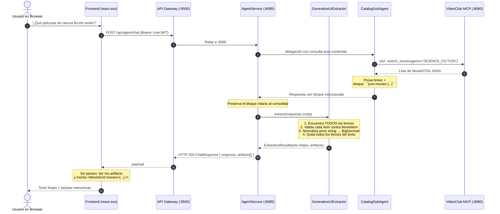

# Patrón Generative UI Híbrido — VideoClub UNRN

**Estado:** Implementado
**Servicios involucrados:** `videoclub-agent` (:8085) y `react-sso` (:5173)
**Documentos complementarios:** [`gateway-agent-integration.md`](./gateway-agent-integration.md) (flujo de llamadas) y [`sso-token-propagation.md`](./sso-token-propagation.md) (modelo de seguridad y relay de JWT).

---

## 1. Motivación y Filosofía Arquitectónica

En asistentes conversacionales modernos, presentar resultados complejos (catálogos, fichas de usuario, carritos) como texto plano con viñetas markdown (`- Titulo: X, Precio: Y`) empobrece la experiencia y desaprovecha las capacidades visuales del frontend.

Reemplazar todo el diálogo por componentes, sin embargo, es un antipatrón. La regla directriz adoptada es:

> **El lenguaje natural conversa, explica y razona; la UI estructurada presenta entidades, exhibe atributos visuales y habilita acciones.**

### Matriz de Decisión: ¿Cuándo Generative UI?

| Caso de Uso | Enfoque | Razón |
|---|---|---|
| Saludos, cortesía o aclaraciones de permisos | **Texto / Markdown** | Mensajes puramente conversacionales, sin estado ni entidad. |
| Explicaciones o razonamientos ("¿Por qué no puedo alquilar?") | **Texto / Markdown** | La fluidez del lenguaje natural es insuperable. |
| Consulta de catálogo (listas, búsquedas, estrenos) | **Generative UI (`MovieGrid` / `MovieCard`)** | Requiere póster, badges de género coloreados, precio destacado y acción *"Ver ficha"*. |
| Padrón de socios | **Generative UI (`SocioCard`)** *(pendiente)* | Requiere avatar, número de socio, estado y badge de deuda. Ver §7. |

---

## 2. Dónde vive el contrato (y por qué se movió)

El modelo emite la data estructurada como un bloque delimitado dentro de su prosa. Eso es inevitable mientras los sub-agentes devuelvan texto libre, pero **no** implica que ese bloque tenga que llegar al browser.

La primera versión parseaba el bloque en React. Como el contrato de UI compartía canal con el texto libre, cada falla del modelo se volvía visible para el usuario:

| Falla | Qué veía el usuario |
|---|---|
| Búsqueda sin resultados (`[]`) | el fence ` ```json:movies [] ``` ` crudo en pantalla |
| Dos bloques en una respuesta consolidada | el segundo bloque crudo (la regex no era global) |
| Un bloque `json:socios` | JSON roto: la rama de movies lo capturaba primero |

**La extracción ahora ocurre en el servidor**, en [`GenerativeUiExtractor`](../src/main/java/ar/unrn/video/agent/generativeui/GenerativeUiExtractor.java), bajo un invariante único:

> **Todo fence reconocido se elimina siempre del texto.** Parsee o no, valide o no, sea su `kind` soportado o no — nunca llega al usuario como texto.

Un artifact se produce sólo si el bloque parsea **y** deja al menos un ítem renderizable. Todo lo demás se descarta con un `WARN`: un hueco acá es un problema del servidor para arreglar, no algo para renderizar. Esos warnings son la señal de que el modelo se está desviando del contrato.

Consecuencia directa: las tres fallas de la tabla dejaron de ser posibles **por construcción**, no por disciplina.

---

## 3. Flujo de Comunicación



---

## 4. Especificación del Contrato

### 4.1. Sub-Agente de Catálogo (`CatalogSubAgent`)

El prompt (ver [`CatalogSubAgent.java`](../src/main/java/ar/unrn/video/agent/subagents/CatalogSubAgent.java), `buildSystemPrompt`) prohíbe explícitamente duplicar atributos en viñetas y exige el bloque `json:movies` al final, con `null` para imagen o precio ausentes. El texto conversacional debe ser sólo una frase breve de introducción.

### 4.2. Orquestador (`AgentService`)

La directriz *PRESERVACIÓN DE ARTEFACTOS GENERATIVE UI* ([`AgentService.java`](../src/main/java/ar/unrn/video/agent/service/AgentService.java)) obliga a preservar intacto el bloque del sub-agente al consolidar, y prohíbe repetir los datos en viñetas.

El prompt también autoriza invocar **ambos** sub-agentes y consolidar una respuesta integrada. El extractor soporta múltiples bloques por respuesta precisamente para no contradecir esa regla.

### 4.3. Extracción y validación (`GenerativeUiExtractor`)

Expresión regular:

```java
"```json(?::([A-Za-z][A-Za-z0-9_-]*))?[ \\t]*\\r?\\n?([\\s\\S]*?)```"
```

El grupo 1 captura el `kind` **explícitamente**. Eso es lo que hace imposible confundir `json:socios` con `json:movies`: la versión anterior alternaba `(?:json:movies|json)`, así que `json:socios` matcheaba por la rama `json` y capturaba `":socios\n[...]"` como payload.

Un fence ` ```json ` pelado (sin sufijo) se trata como `movies`. Es un fallback **deliberado**, no accidental: los modelos a veces omiten el sufijo.

Validación por ítem en [`MovieItem`](../src/main/java/ar/unrn/video/agent/generativeui/MovieItem.java):

- `id` y `title` son obligatorios; un ítem sin ellos no se puede renderizar ni navegar, y se descarta. **Se valida cada elemento, no sólo el primero.**
- `price` se declara `BigDecimal`, de modo que Jackson normaliza el `"150.00"` string que pide el prompt. El artifact que sale del servicio siempre lleva un número, y el tipo `Movie.price?: number` del frontend deja de mentir.
- Propiedades desconocidas se ignoran: un campo inventado por el modelo no debe tumbar la extracción entera.

**Limpieza del texto.** El extractor además filtra viñetas redundantes de atributos (`- Título:`, `- Precio:`, …) y líneas de imagen markdown sueltas. Es la red para cuando el modelo desobedece el prompt. Antes vivía en el browser, así que los clientes no-web no se beneficiaban; ahora sí.

### 4.4. Payload

```java
public record UiArtifact(String kind, List<Object> items) {}
```

`ChatResponse` expone `artifacts`. `kind` es el discriminador que el frontend conmuta: **un dominio nuevo es un `kind` nuevo, nunca una regex nueva.**

### 4.5. Frontend (`react-sso`)

Ya no hay parseo en el browser. [`agentApi.ts`](../../react-sso/src/api/agentApi.ts) expone `moviesFrom(artifacts)`, que junta las tarjetas del turno a través de todos los bloques que haya producido el agente. [`AgentChatView.tsx`](../../react-sso/src/components/routes/AgentChatView.tsx) guarda `movies` en el `ChatMessage` y renderiza el texto tal cual llega.

---

## 5. Componentes UI

### `MovieCard` (`src/components/chat/MovieCard.tsx`)
- **Póster**: caja de altura fija (145 px) a ancho completo, zoom sutil al hover (`scale(1.05)`) y fallback automático a placeholder si la URL está rota o ausente.
- **Badge de Género**: paleta `GENRE_COLORS`, consistente con la vista general de películas.
- **Identificador**: `#<id>` visible para referencia rápida.
- **Precio**: resaltado, con formato monetario.
- **Acción**: botón *"Ver ficha →"* que navega vía `react-router-dom` a `/movies/:id`.

### `MovieGrid` (`src/components/chat/MovieGrid.tsx`)
- Scroll horizontal (`overflow-x: auto`), contador de resultados y márgenes adaptados a la burbuja de chat.

---

## 6. Resiliencia y Degradación

1. **Cliente no-Web o CLI**: recibe prosa limpia, sin fences ni viñetas redundantes. Antes esto dependía de que el bloque fuera markdown válido; ahora está garantizado en el servidor.
2. **JSON malformado**: se descarta con `WARN` y el fence igual se remueve. El usuario lee la frase del asistente; nunca ve JSON roto.
3. **Resultado vacío (`[]`)**: no genera artifact y el fence ya fue removido. El usuario lee simplemente "No encontré películas con ese criterio".
4. **`kind` no soportado**: se descarta con `WARN`. Es una decisión consciente — mostrar JSON crudo a un usuario final nunca es correcto — y el log es la señal para agregar la rama faltante.
5. **Imágenes markdown tradicionales**: si el modelo responde con ``, `formatText` lo dibuja como `` con estilo controlado y manejo de error.

### Cobertura

[`GenerativeUiExtractorTest`](../src/test/java/ar/unrn/video/agent/generativeui/GenerativeUiExtractorTest.java) fija cada una de estas fallas con un test nombrado: array vacío, bloques múltiples, `json:socios`, JSON malformado, fence pelado, validación de todos los ítems, normalización de precio, limpieza de viñetas, texto plano, y entrada nula o en blanco.

---

## 7. Extender a un dominio nuevo (ej. Socios)

Hoy un bloque `json:socios` se remueve del texto y se descarta con `WARN`. Para renderizarlo:

1. **Prompt del sub-agente**: agregar en `MembershipSubAgent.buildSystemPrompt` la regla de salida `json:socios` con los atributos del dominio.
2. **Modelo**: crear `SocioItem` con su propio `isRenderable()`.
3. **Extractor**: agregar la rama del `kind` `"socios"` en `toArtifact`. **No hay que tocar la regex** — el `kind` ya se captura genéricamente.
4. **Frontend**: crear `SocioCard.tsx` / `SocioGrid.tsx` y un `sociosFrom(artifacts)` análogo a `moviesFrom`.

---

## 8. Límite conocido del patrón

El dato sigue pasando por el modelo: el sub-agente recibe el resultado de la tool MCP y lo **retipea** dentro del bloque JSON. La validación del servidor atrapa lo malformado y lo incompleto, pero no puede detectar un `id` o un `price` que el modelo transcribió mal.

Eliminarlo requiere que el artifact se construya desde la salida cruda de la tool — `TrackingToolCallback` ya intercepta cada invocación y es el lugar natural — de modo que el modelo escriba únicamente prosa. Queda como próxima iteración; ver también [`agui-streaming-plan.md`](./agui-streaming-plan.md), donde este campo `artifacts` mapea uno a uno a los eventos `STATE_SNAPSHOT` / `CUSTOM` de AG-UI.
