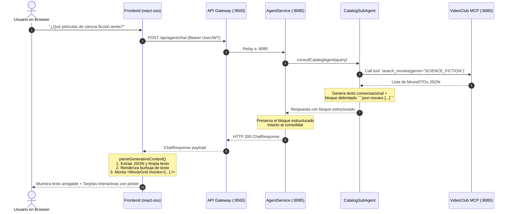

# Patrón Generative UI Híbrido — VideoClub UNRN

**Estado:** Implementado  
**Servicios involucrados:** `videoclub-agent` (:8085) y `react-sso` (:5173)  
**Documentos complementarios:** [`gateway-agent-integration.md`](./gateway-agent-integration.md) (flujo de llamadas) y [`sso-token-propagation.md`](./sso-token-propagation.md) (modelo de seguridad y relay de JWT).

---

## 1. Motivación y Filosofía Arquitectónica

En asistentes conversacionales modernos, presentar resultados complejos (como catálogos de productos, fichas de usuarios o carritos) como texto plano con viñetas markdown (`- Titulo: X, Precio: Y`) empobrece la experiencia de usuario y desaprovecha las capacidades visuales del frontend.

Sin embargo, intentar reemplazar todo el diálogo por componentes de UI es un antipatrón. La regla directriz adoptada es:

> **El lenguaje natural conversa, explica y razona; la UI estructurada presenta entidades, exhibe atributos visuales y habilita acciones.**

### Matriz de Decisión: ¿Cuándo Generative UI?

| Caso de Uso | Enfoque | Razón |
|---|---|---|
| Saludos, cortesía o aclaraciones de permisos | **Texto / Markdown** | Son mensajes puramente conversacionales sin estado ni entidad. |
| Explicaciones o razonamientos ("¿Por qué no puedo alquilar?") | **Texto / Markdown** | La fluidez de la respuesta en lenguaje natural es insuperable. |
| Consulta de catálogo (listas de películas, búsquedas, estrenos) | **Generative UI (`MovieGrid` / `MovieCard`)** | Requiere póster visual, badges de género coloreados, precio destacado y botón *"Ver ficha"*. |
| Padrón de socios / miembros | **Generative UI (`SocioCard`)** *(extensible)* | Requiere avatar, número de socio, estado y badge de deuda. |

---

## 2. Flujo de Comunicación (Diagrama de Secuencia)

El patrón utiliza un **contrato híbrido**: el LLM genera prosa amigable para el usuario y añade al final un bloque estructurado delimitado (fenced code block) ````json:movies [...] ```` que el frontend intercepta y monta como componentes nativos de React.



---

## 3. Especificación del Contrato

### 3.1. Sub-Agente de Catálogo (`CatalogSubAgent`)
El prompt del especialista en catálogo define la regla estricta de salida:
```
REGLA DE FORMATO GENERATIVE UI: Cuando la respuesta contenga una o más películas obtenidas del catálogo,
proporcioná una breve introducción natural y amigable en español, y agregá SIEMPRE al final un bloque JSON estricto
delimitado exactamente con la sintaxis:
```json:movies
[
  {"id": 10029, "title": "Nombre", "genre": "SCIENCE_FICTION", "price": "150.00", "imageUrl": "https://..."}
]
```
No dupliques la lista de películas con viñetas markdown o imágenes en el texto; dejá los datos estructurados en el bloque json:movies.
Si una película no tiene imagen o precio, incluí null.
```

### 3.2. Orquestador (`AgentService`)
El Orquestador supervisor tiene como directriz explícita **preservar artefactos**:
```
- PRESERVACIÓN DE ARTEFACTOS GENERATIVE UI: Si la respuesta de un sub-agente incluye un bloque estructurado delimitado (por ejemplo ```json:movies [...] ```), debés PRESERVAR intacto ese bloque al final de tu respuesta para que la interfaz web pueda renderizar las tarjetas interactivas.
```

### 3.3. Frontend (`react-sso`)
En [`AgentChatView.tsx`](../../react-sso/src/components/routes/AgentChatView.tsx), la función `parseGenerativeContent`:
1. Identifica el bloque ```` ```json:movies([\s\S]*?)``` ```` mediante expresión regular.
2. Parsea el array mediante `JSON.parse` con validación de tipo segura.
3. Si el JSON es válido, lo remueve del texto del mensaje (para no mostrar código crudo en la burbuja).
4. Retorna el texto limpio y el array tipado `movies: Movie[]`.
5. Renderiza:
   - El texto del asistente formateado.
   - Debajo, el componente [`MovieGrid`](../../react-sso/src/components/chat/MovieGrid.tsx) conteniendo las [`MovieCard`](../../react-sso/src/components/chat/MovieCard.tsx).

---

## 4. Componentes UI Implementados

### `MovieCard` (`src/components/chat/MovieCard.tsx`)
- **Póster**: Dimensionado con aspect ratio 2:3, zoom sutil al hover y fallback automático a placeholder si la URL de imagen está rota o ausente.
- **Badge de Género**: Utiliza la paleta cromática oficial de la aplicación (`GENRE_COLORS`), consistente con la vista general de películas.
- **Etiqueta de Identificador**: `#<id>` visible para referencia rápida.
- **Precio**: Resaltado en color primario con formato monetario.
- **Acción interactiva**: Botón *"Ver ficha →"* que dispara la navegación mediante `react-router-dom` hacia la ruta `/movies/:id`.

### `MovieGrid` (`src/components/chat/MovieGrid.tsx`)
- Contenedor con scroll horizontal optimizado (`overflow-x: auto`), contador de resultados encontrados y márgenes adaptados a la burbuja de chat.

---

## 5. Resiliencia y Fallbacks (Graceful Degradation)

1. **Cliente no-Web o CLI**: Si un cliente (ej. terminal curl o cliente sin Generative UI) consume el endpoint `/api/agent/chat`, el bloque ````json:movies```` es un bloque de código Markdown perfectamente estándar que no rompe el renderizado.
2. **Error de parseo JSON**: Si el modelo generase un JSON malformado, `parseGenerativeContent` captura la excepción con `try/catch` y muestra el texto tal cual llegó, sin crashear el árbol de React.
3. **Imágenes en Markdown tradicional**: Si el LLM respondiese con sintaxis clásica ``, el formateador `formatText` ahora interpreta la etiqueta y la dibuja como `` controlada con estilo redondeado y manejo de error, en lugar de imprimir sintaxis de texto cruda.

---

## 6. Guía de Extensibilidad: Nuevos Dominios (Ej. Socios)

Para extender el patrón a otro sub-agente (por ejemplo, `MembershipSubAgent`):
1. **Prompt del Sub-agente**: Agregar la regla de salida delimitada ````json:socios [...] ```` con los atributos `id`, `nombre`, `estado`, `deuda`.
2. **Componente React**: Crear `SocioCard.tsx` y `SocioGrid.tsx` en `react-sso/src/components/chat/`.
3. **Parser en Chat**: Extender `parseGenerativeContent` para detectar `json:socios` y renderizar `<SocioGrid socios={socios} />`.
